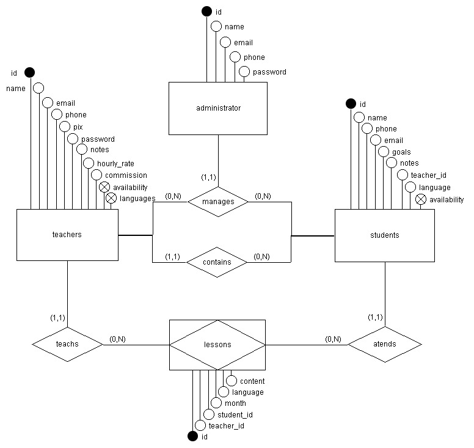
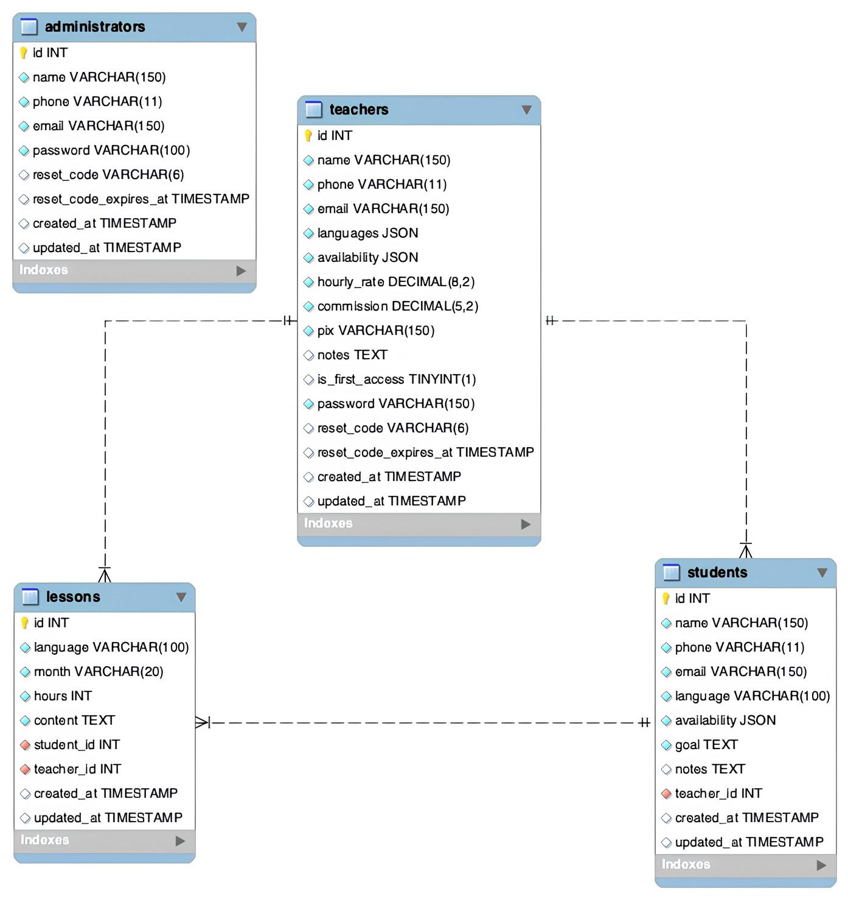

<h1 align="center" style="font-weight: bold;">Lemma Languages 🇧🇷🇺🇸</h1>

 <a href="#technologies">Tecnologias</a> • 
 <a href="#description">Descrição</a> • 
 <a href="#database-models">Modelagens</a> • 
 <a href="#requirements">Requisitos</a> • 
 <a href="#installation">Instalação</a> •
 <a href="#commands">Comandos</a> •
 <a href="#extensions">Extensões</a> • 
 <a href="#collaborators">Colaboradores</a>

<h2 id="technologies">💻 Tecnologias</h2>

   

<h2 id="description">📚 Descrição</h2>

O projeto <strong>Lemma Languages</strong> é um sistema de gerenciamento projetado para escolas de idiomas. Ele oferece uma interface completa para administradores controlarem alunos, professores e suas interações ao longo dos meses.

<b>Principais funcionalidades:</b>
<ul>
  <li>Cadastrar, atualizar, listar e excluir professores e alunos;</li>
  <li>Cada professor cadastrado recebe acesso de login ao sistema;</li>
  <li>Os professores podem enviar mensalmente:
    <ul>
      <li>O total de horas de aula dadas por aluno;</li>
      <li>O conteúdo abordado em cada sessão.</li>
    </ul>
  </li>
  <li>O painel de administração é automaticamente atualizado com:
    <ul>
      <li>O total pago a cada professor (considerando todos os seus alunos);</li>
      <li>A divisão financeira: quanto fica com o professor (ex: 70%) e quanto vai para a escola (ex: 30%).</li>
    </ul>
  </li>
</ul>

<b>Modelo de relacionamento:</b>
<ul>
  <li>Cada aluno está vinculado a um único professor;</li>
  <li>Cada professor pode ser responsável por vários alunos.</li>
</ul>

<h2 id="database-models">🎲 Modelos de Banco de Dados</h2>

<strong>Modelo Conceitual</strong>

  

<strong>Modelo Lógico</strong>

  

<h2 id="requirements">📋 Requisitos</h2>

- PHP
- Composer
- Node

<h2 id="installation">⚙️ Instalação</h2>

- 1: Clone este repositório: `git clone https://github.com/Quanty-IT/lemma-languages.git`;
- 2: Crie um arquivo `.env` a partir do arquivo `.env.example`;
- 3: Preencha todas as variáveis necessárias no arquivo `.env`;
- 4: Instale as dependências PHP, executando o comando: `composer install`;
- 5: Instale as dependências JavaScript, executando o comando: `npm install`;
- 6: Gere os arquivos de produção com o comando: `npm run build`;
- 7: Execute as migrações, rodando o comando: `php artisan migrate`;
- 8: Rode a aplicação, executando o comando: `php artisan serve`

<h2 id="commands">💡 Comandos Úteis</h2>

<ul>
  <li>Criar uma nova view: <code>php artisan make:view nome-aqui</code></li>
  <li>Criar um novo controlador: <code>php artisan make:controller NomeAquiController</code></li>
  <li>Criar um novo modelo: <code>php artisan make:model NomeAqui</code></li>
  <li>Criar uma nova migração: <code>php artisan make:migration create_tabela_nome_aqui</code></li>
  <li>Rodar as migrações: <code>php artisan migrate</code></li>
  <li>Reverter a última migração: <code>php artisan migrate:rollback</code></li>
</ul>

<h2 id="extensions">🔌 Extensões Recomendadas</h2>

<ul>
  <li>
    <strong><a href="https://marketplace.visualstudio.com/items?itemName=bmewburn.vscode-intelephense-client">PHP Intelephense</a></strong> — IntelliSense poderoso, autocompletar e validação para PHP
  </li>
  <li>
    <strong><a href="https://marketplace.visualstudio.com/items?itemName=shufo.vscode-blade-formatter">Laravel Blade Formatter</a></strong> — Formata automaticamente arquivos Blade (.blade.php)
  </li>
  <li>
    <strong><a href="https://marketplace.visualstudio.com/items?itemName=onecentlin.laravel-blade">Laravel Blade Snippets</a></strong> — Snippets úteis para agilizar o desenvolvimento com Blade
  </li>
  <li>
    <strong><a href="https://marketplace.visualstudio.com/items?itemName=alexcvzz.vscode-sqlite">SQLite Viewer</a></strong> — Visualize e edite o banco de dados SQLite diretamente no VS Code
  </li>
</ul>

<h2 id="collaborators">🤝 Colaboradores</h2>

<table>
  <tr>
    <td align="center">
      <a href="https://github.com/victorozoterio">
         
        
          <a href="https://github.com/victorozoterio">
          Victor Ozoterio</a>
        
      </a>
    </td>
    <td align="center">
      <a href="https://github.com/Murilocampoos">
         
        
          <a href="https://github.com/Murilocampoos">
          Murilo Campos</a>
        
      </a>
    </td>
    <td align="center">
      <a href="https://github.com/bds-dat">
         
        
          <a href="https://github.com/bds-dat">
          Bianca Disanti</a>
        
      </a>
    </td>
    <td align="center">
      <a href="https://github.com/PedroHDenny">
         
        
          <a href="https://github.com/PedroHDenny">
          Pedro Denny</a>
        
      </a>
    </td>
  </tr>
</table>
